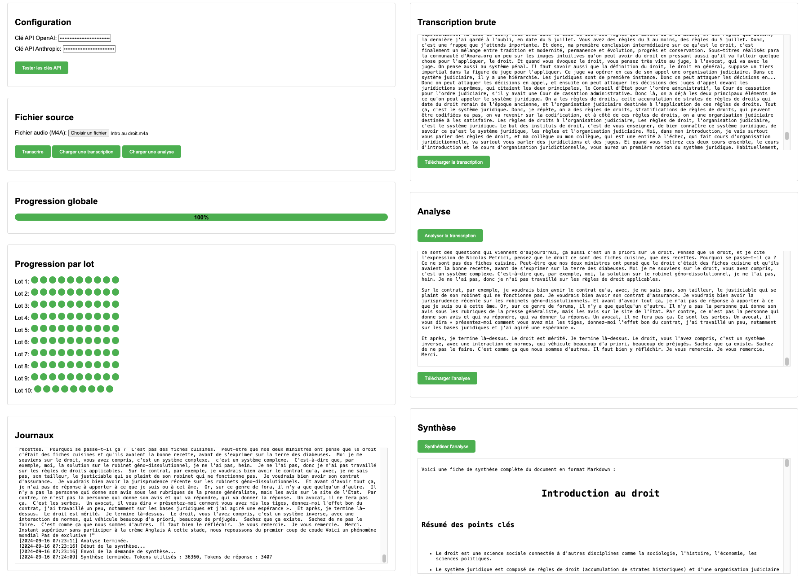

# Transkryptor

> 🇫🇷 [Lire en français](./README_FR.md)



A modern web platform for audio transcription, analysis, and synthesis — built on top of the [Cloud Temple LLMaaS](https://www.cloud-temple.com/) SecNumCloud-qualified API.

## Table of contents

- [Highlights](#highlights)
- [Architecture](#architecture)
- [Quick start](#quick-start)
- [Configuration](#configuration)
- [Usage](#usage)
- [Project layout](#project-layout)
- [Roadmap](#roadmap)
- [License](#license)

## Highlights

- **Parallel audio transcription** at scale. Files are chunked, transcribed in parallel via Whisper, and reassembled. Handles mono/stereo and common formats (MP3, WAV, M4A).
- **Analysis & synthesis**. The transcript is split into semantic batches, analyzed in parallel by a configurable LLM, then synthesized into a structured report.
- **Five synthesis presets** out of the box — executive summary, meeting minutes, action items, cleaned verbatim, thematic analysis — plus a fully custom prompt mode.
- **Speaker diarization** (LLM-based). Identifies turns of speech from the transcript with optional speaker-count hinting, streamed live as it runs.
- **Multilingual interface**: French and English UI; 15+ supported audio languages with auto-detection and an independent synthesis target language.
- **lesur.ai visual identity**: current v6.1 refresh with the cream/navy/cyan/amber design system, self-hosted Newsreader typography, and local runtime assets.
- **Real-time observability**: per-chunk progress grid, performance chart, live server logs over SSE.
- **Cloud Temple LLMaaS backend**: all calls go through the sovereign SecNumCloud-qualified Cloud Temple API. No third-party LLM providers in the data path.
- **Secure API gateway**: the API key lives server-side in environment variables and is never exposed to the browser.

## Architecture

A Node.js/Express backend acts as an API gateway to the Cloud Temple LLMaaS endpoints (transcription, chat completions, diarization). The frontend is a vanilla-JavaScript single-page application served by the same Node process — no bundler, no framework.

```
browser ──► Node.js/Express gateway ──► Cloud Temple LLMaaS (Whisper + LLM)
```

## Quick start

**Prerequisites**: [Node.js](https://nodejs.org/) 18 or higher, and a Cloud Temple LLMaaS API key.

Recommended macOS/Linux install:

```bash
curl -fsSL https://raw.githubusercontent.com/Lesur-ai/transkryptor/v6.2.0/scripts/install.sh | bash
```

The script installs the app into `~/Applications/Transkryptor` on macOS and `${XDG_DATA_HOME:-~/.local/share}/transkryptor` on Linux. It copies `.env.example` to `.env` when needed, runs `npm ci`, starts the service on <http://localhost:3000>, and opens the default browser.

Useful overrides:

```bash
curl -fsSL https://raw.githubusercontent.com/Lesur-ai/transkryptor/v6.2.0/scripts/install.sh -o /tmp/transkryptor-install.sh
TRANSKRYPTOR_INSTALL_DIR="$HOME/Transkryptor" \
TRANSKRYPTOR_REF="main" \
TRANSKRYPTOR_OPEN_BROWSER="0" \
bash /tmp/transkryptor-install.sh
```

On Windows, use WSL for now:

```powershell
wsl bash -lc "curl -fsSL https://raw.githubusercontent.com/Lesur-ai/transkryptor/v6.2.0/scripts/install.sh | bash"
```

A native Windows installer should be a small PowerShell script that installs into `%LOCALAPPDATA%\Transkryptor`, runs `npm ci`, starts the Node service, and opens <http://localhost:3000>.

Manual setup:

```bash
git clone https://github.com/Lesur-ai/transkryptor.git
cd transkryptor
npm install
cp .env.example .env
# Edit .env — set CLOUD_TEMPLE_API_KEY and CLOUD_TEMPLE_ALLOWED_MODELS
npm start
```

Then open <http://localhost:3000>.

For development with auto-reload:

```bash
npm run dev
```

### Docker

```bash
docker compose up --build
```

## Configuration

All configuration lives in a `.env` file at the project root. Copy `.env.example` and fill in your values.

| Variable | Required | Purpose |
| --- | --- | --- |
| `PORT` | no (default `3000`) | Port the server listens on. |
| `CLOUD_TEMPLE_API_KEY` | **yes** | Bearer token for the Cloud Temple LLMaaS API. |
| `CLOUD_TEMPLE_ALLOWED_MODELS` | **yes** | Comma-separated list of model IDs exposed in the UI. The order is also the display order, and the first entry is the default selected model. |

## Usage

1. Pick an analysis model from the sidebar dropdown.
2. Drop or pick an audio file (`.mp3`, `.wav`, `.m4a`).
3. Optional — pick an audio language (or leave auto-detect) and a target synthesis language.
4. Optional — enable participant detection if the audio has multiple speakers.
5. Click **Start processing**. Per-chunk progress, speed stats, and a performance chart light up as the work runs.
6. Once analysis is done, **Synthesis** becomes available. Pick a preset (or customize the prompt under *Advanced prompts*) and run it.
7. Use **Download** to save the active tab's content as Markdown.

## Project layout

```
transkryptor/
├── src/
│   ├── client/
│   │   ├── css/
│   │   ├── i18n/             # FR/EN UI translations
│   │   ├── img/
│   │   ├── js/
│   │   │   ├── ui/           # UI modules (stats, chart, progress, results)
│   │   │   ├── analysisProcessor.js
│   │   │   ├── apiService.js
│   │   │   ├── audioProcessor.js
│   │   │   ├── main.js
│   │   │   └── …
│   │   └── index.html
│   └── server/
│       ├── logger.js
│       └── server.js
├── .env.example
├── docker-compose.yml
├── Dockerfile
├── scripts/
│   └── install.sh          # macOS/Linux one-line installer
├── package.json
└── README.md
```

## Roadmap

- More audio/video container formats.
- Project-level user authentication.
- Persistent session storage for transcripts.

## License

GPL 3.0 — see [LICENSE.txt](LICENSE.txt).

---

Built with ❤️ by [lesur.ai](https://lesur.ai).
